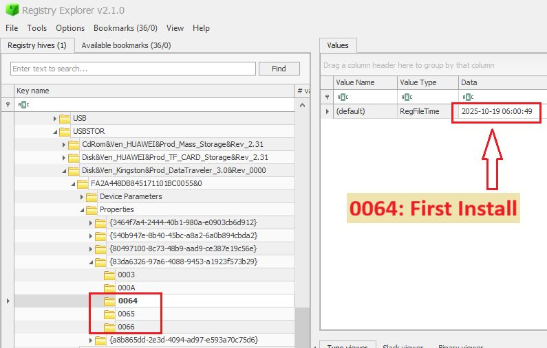

**USB Forensics Part 1: Unasking the Connected Device**[1](https://www.linkedin.com/posts/morad-rawashdeh_usbforensics-dfir-windowsforensics-activity-7385564679512961024-TAL7)

Windows keeps a detailed `resume` for every connected USB

**1. Devide Identity: The USBSTROR & USB Keys**

To uniquely identify a connected storage device (such as a flash drive or external hard drive), you need its hardware identifiers. These are found in the `SYSTEM` hive.

- **For Storage Devices Only:** Check `SYSTEM\CurrentControlSet\Enum\USBSTOR`. This is the key site for flash drives and external hard disks, where you can extract thr **Vendor ID (VID)** and **Product ID (PID)**, and the unique **Seria Number**
- **For All USB Devices:** Check `SYSTEM\CurrentControlSet\Enum\USB`. This key contains information for a wider range of devices (e.g. keyboards, mice) and provides the  **Vendor ID (VID)** and **Product ID (PID)**

**Actionable Tip:** The _Serial Number_ found under `USBSTOR` is your golder key! Use this unique identifier to track the device across all other forensic astifacts.

**2. Timelines: The Properties Key**

Once you have the device's unique identifier, you can find precise connection timestamps under its specific key structure(e.g `SYSTEM\CurrentControlSet\Enum\USBSTOR\[DeviceID]\Properties`).

Windows uses numeric prperty codes to record critical dated:

- **Code `0064`**: The **First Install** timestamp (the very first time the device was connected).
- **Code `0066`**: The **Last Connected** timestamp (the most recent connection time)
- **Code `0067`**: The **Last Removed** timestamp (the most recent disconnection time)

**Actionable Tip:**  Extract the values for these codes. **WARNING:** These timestamps are often stored in a non-standard Windows format (_RegFileTime_).  You must use a dedicated registry analysis tool (like **Registry Explorer**[2](https://www.sans.org/tools/registry-explorer)

Sources:

[1] https://www.linkedin.com/posts/morad-rawashdeh_usbforensics-dfir-windowsforensics-activity-7385564679512961024-TAL7

[2] https://www.sans.org/tools/registry-explorer

